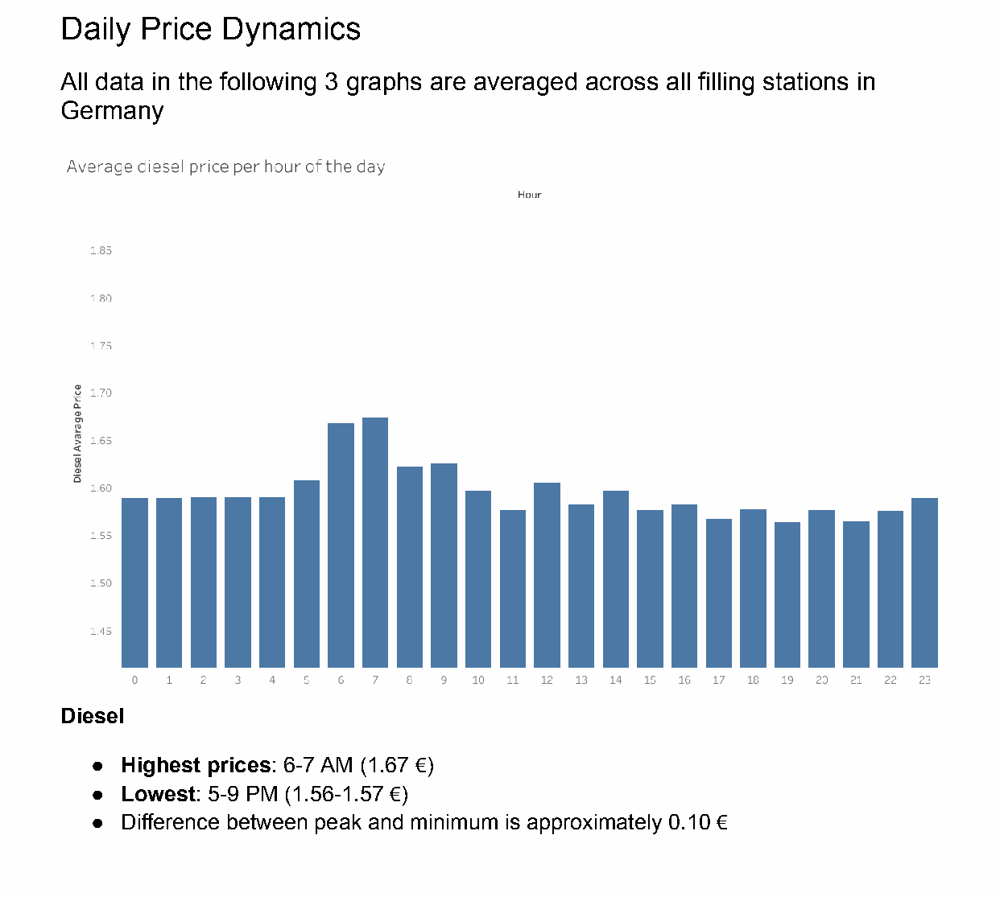
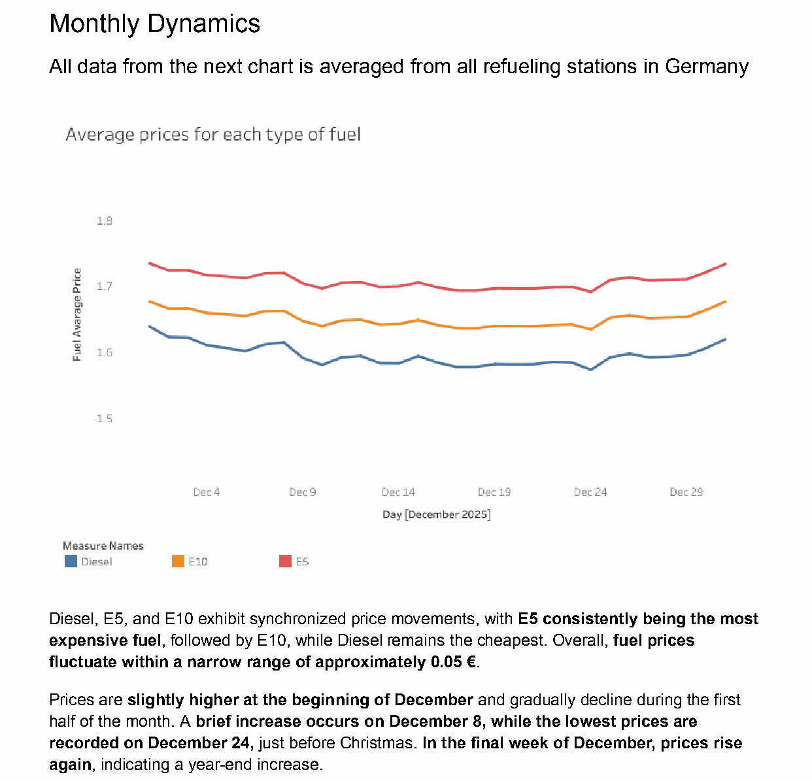
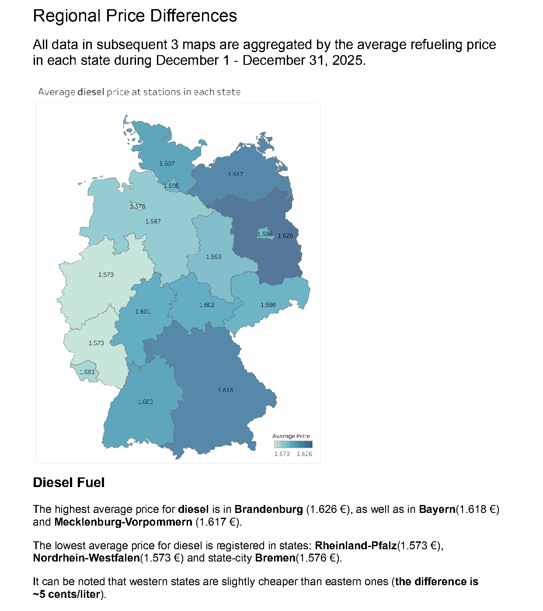

# Fuel Price Analysis — Germany & Bavaria
**December 2025 | Python, pandas, GeoPandas, Tableau | Data: Tankerkönig API**

An analysis of real-world fuel price data across Germany, with a dedicated deep-dive into Bavaria. The goal was to find patterns in pricing — by time of day, day of month, region, and fuel brand — that could help drivers make smarter refuelling decisions.

**[🔗 Explore the interactive dashboard on Tableau Public](https://public.tableau.com/app/profile/vladyslav.yakymchuk/viz/PortfolioTankkoenigGeneralDecember2025/state_avg_e5)**

---

## Key Findings

**Best time to refuel:** Prices are lowest between **5–9 PM** across all fuel types. Peak prices occur at **6–7 AM**. The difference is up to **€0.10/litre** — worth knowing if you fill a full tank.



**Monthly pattern:** Prices dip toward **Christmas Eve (Dec 24)** and rise again in the final week of December. A brief spike occurs around **December 8**.



**Regional differences:** Western German states (Rheinland-Pfalz, NRW) are consistently **~5 cents/litre cheaper** than eastern states (Brandenburg, Sachsen) for diesel.



**Brand comparison (Bavaria):** ENI and Aral are consistently the most expensive brands. Independent and discount stations (Sprint, ALLGUTH, Raiffeisen) are significantly cheaper — up to **€0.15/litre difference**.

**E5 vs E10:** E5 is always **3–4% more expensive** than E10 in the same region and station.

**Bavaria vs Germany:** Bavaria follows the national trend almost exactly, with slightly smoother daily fluctuations.

*Full reports with all charts (brand breakdown, both fuel types, station-network maps): [`Analysis of fuel prices in Germany.pdf`](<Analysis of fuel prices in Germany.pdf>), [`Analysis of fuel prices in Bayern.pdf`](<Analysis of fuel prices in Bayern.pdf>) — or click through the charts yourself on the [interactive Tableau dashboard](https://public.tableau.com/app/profile/vladyslav.yakymchuk/viz/PortfolioTankkoenigGeneralDecember2025/state_avg_e5).*

---

## Data Cleaning

Raw data: 31 daily CSV exports for December 2025 from the Tankerkönig API — **13.6M price-update rows** across the month, plus **548K daily station-metadata snapshots**.

**Prices** ([`tankkoenig-prices-cleaning.ipynb`](tankkoenig-prices-cleaning.ipynb)):
- Timestamps parsed and normalized to a single timezone (`Europe/Berlin`)
- Invalid prices (≤ 0€ — a placeholder value in the raw feed, affecting 0.03–4.2% of rows depending on fuel type) replaced with `NaN` rather than dropping the row, so the rest of that row stays usable
- Aggregated to hourly, daily, and full-month station averages; gaps from stations with no update in a given hour are forward-filled from their last known price

**Stations** ([`tankkoenig-stations-cleaning.ipynb`](tankkoenig-stations-cleaning.ipynb)):
- De-duplicated 548K daily snapshots down to **17,707 unique stations**
- Brand names normalized from free text (inconsistent casing/spelling) to a fixed brand list via token-frequency analysis — covers **~73%** of stations; the rest are independents or smaller chains not in the mapping
- Each station assigned to a German state via a spatial join (GeoPandas, GADM administrative boundaries) against its coordinates, after filtering out placeholder `(0, 0)` coordinates

Both notebooks document each cleaning step inline (problem → action → result), with a full summary table and known limitations at the end of each.

---

## Project Structure

```
├── tankkoenig-prices-cleaning.ipynb        # Price data cleaning & aggregation
├── tankkoenig-stations-cleaning.ipynb      # Station metadata cleaning & geocoding
├── Analysis of fuel prices in Germany.pdf  # Full report — Germany
├── Analysis of fuel prices in Bayern.pdf   # Full report — Bavaria
├── images/                                 # Chart screenshots used in this README
└── README.md
```

---

## Tools & Methods

- **Python** (pandas, NumPy, GeoPandas) — data cleaning, aggregation, geospatial join, transformation
- **Tableau** — choropleth maps, time series charts, bar charts; [published on Tableau Public](https://public.tableau.com/app/profile/vladyslav.yakymchuk/viz/PortfolioTankkoenigGeneralDecember2025/state_avg_e5)
- **Tankerkönig API** — real-time German fuel price data (MTS-K)
- Analysis covers ~15,000+ active stations (17,707 registered) across all 16 German federal states

---

## Data Source & License

Data provided by [Tankerkönig UG](https://tankerkoenig.de) via their public API, based on data from the German Market Transparency Unit for Fuels (MTS-K).

Licensed under [CC BY-NC-SA 4.0](https://creativecommons.org/licenses/by-nc-sa/4.0/). Project is non-commercial and for portfolio purposes only. No raw data is redistributed — this also applies to the processed/aggregated CSV files the notebooks generate (`tankkoenig_hourly_prices.csv`, `tankkoenig_daily_prices.csv`, `tankkoenig_station_times_prices.csv`, `cleaned_tankstellen.csv`): they're produced locally when the notebooks run, but aren't included in this repository.
